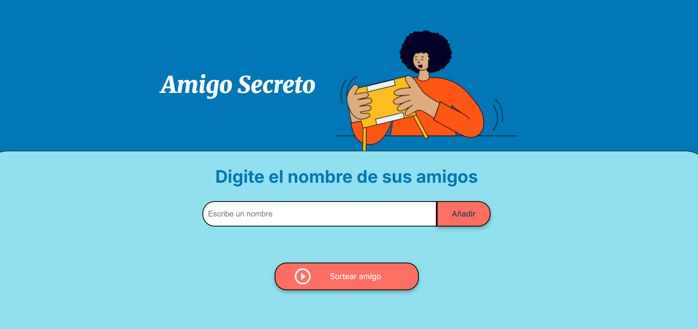
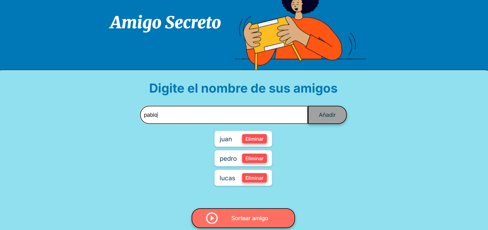
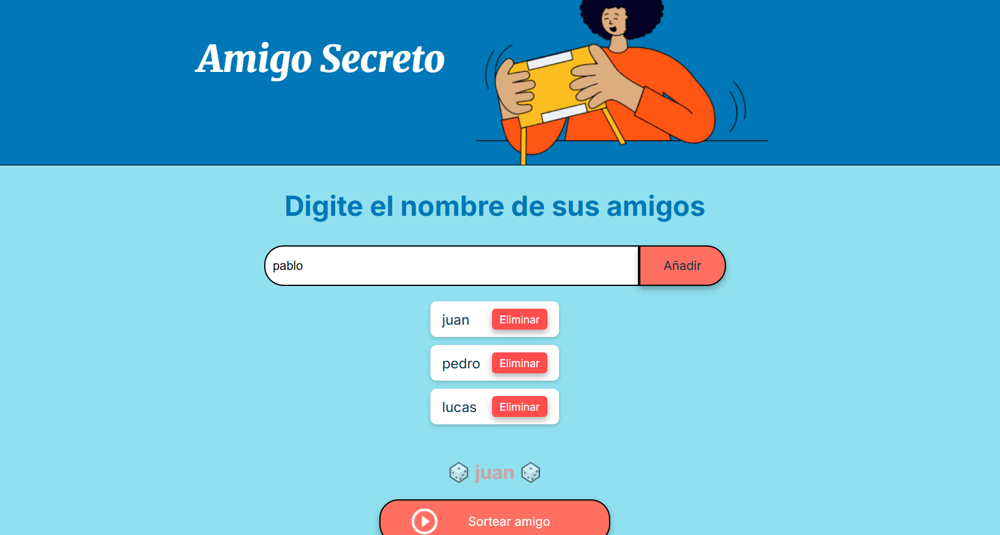
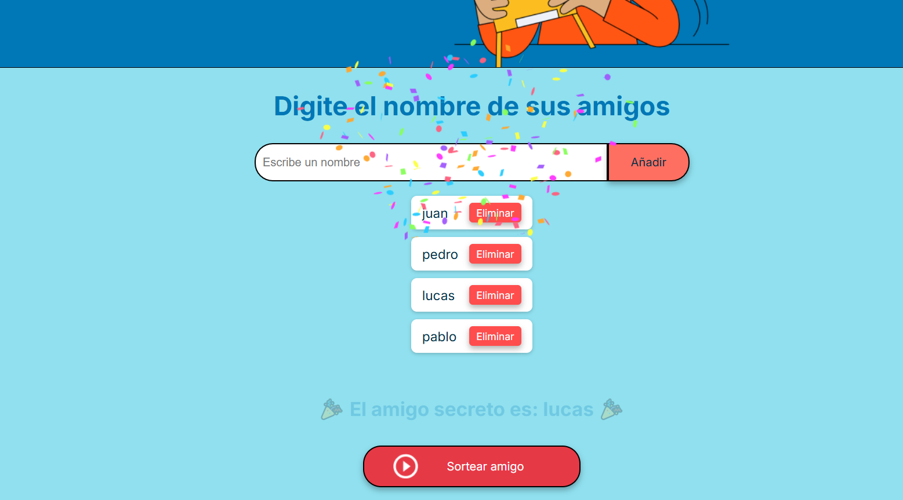

# 🎁 Sorteo Amigo Secreto

¡Bienvenido al **Sorteo Amigo Secreto**! 🎉  
Este proyecto es una aplicación web interactiva que permite realizar un sorteo aleatorio de un amigo secreto, con animaciones, efectos de sonido y confeti.  

## 📌 Características

✅ Animaciones de sorteo estilo ruleta.  
✅ Efecto de sonido de celebración.  
✅ Confeti al revelar el ganador.  
✅ Interfaz simple e intuitiva.  

## 🚀 Tecnologías Utilizadas

- **HTML5** → Estructura de la aplicación  
- **CSS3** → Estilos y animaciones  
- **JavaScript** → Lógica del sorteo  

## 📂 Estructura del Proyecto

📦 amigo-secreto-challenge │-- 📂 assets # Imágenes y sonidos │-- 📄 index.html # Página principal │-- 📄 style.css # Estilos y animaciones │-- 📄 app.js # Lógica del sorteo │-- 📄 README.md # Descripción del proyecto


## 🛠 Instalación y Uso

1. **Clona este repositorio:**
   ```sh
   git clone https://github.com/Alejolora25/amigo-secreto-challenge.git
Abre index.html en tu navegador.
Agrega nombres a la lista y haz clic en "Sortear".
¡Disfruta la animación y descubre el amigo secreto! 🎲🎉
🎨 Capturas de Pantalla


📢 Contribución
Si deseas mejorar este proyecto, ¡siéntete libre de hacer un fork y enviar un pull request! 🚀

📜 Licencia
Este proyecto está bajo la licencia MIT. Puedes usarlo y modificarlo libremente.

💡 Desarrollado con pasión por @Alejolora25.


## 📸 Vista Previa

### Pantalla Inicial


### Agregando un Amigo


### Sorteando


### Resultado Final

